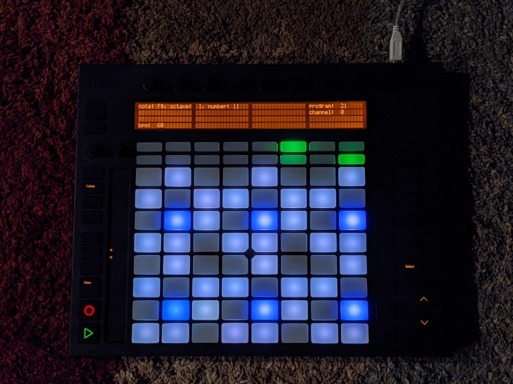

MidiPush
========

MidiPush is a MIDI sequencer designed to be used from an external controller such as the Ableton Push for live performance.

It can be installed on a small device such as a Raspberry Pi and used without a monitor or keyboard.

Currently, only the Ableton Push (one) is supported.

